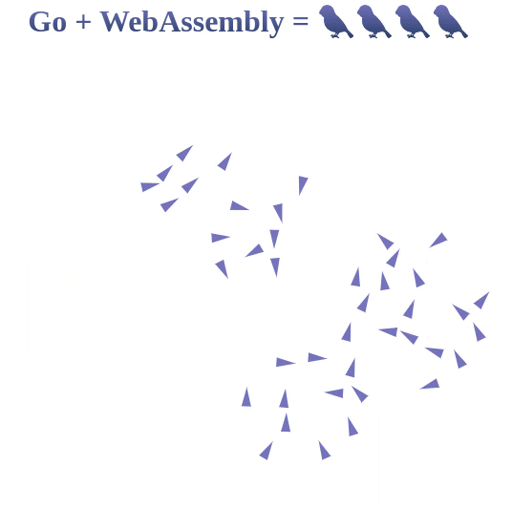

# go-boids
Boid flock implemented in Go with WebAssembly. 


## Installation
1. Clone this project

2. Make sure you have Go installed. If not, [install Go](https://golang.org/doc/install)

3. Install goexec by running `go get -v -u github.com/shurcooL/goexec`

You're all set for running the program!

## Running
1. Spin up a web server by running ```goexec 'http.ListenAndServe(`:8080`, http.FileServer(http.Dir(`.`)))'```
2. Build the program by running `build.sh`
3. Navigate to localhost:8080 to see the boids! :bird:


## Notes
This is a quite bare-bones example of a boid flock. There is still a lot to do, and much fine tuning of parameters can be performed.
If you want to experiment more with this yourself, [this](http://www.vergenet.net/~conrad/boids/pseudocode.html) is a good start. Factors such as attractors/gravity, acceleration and interactivity is not present in this demo.
